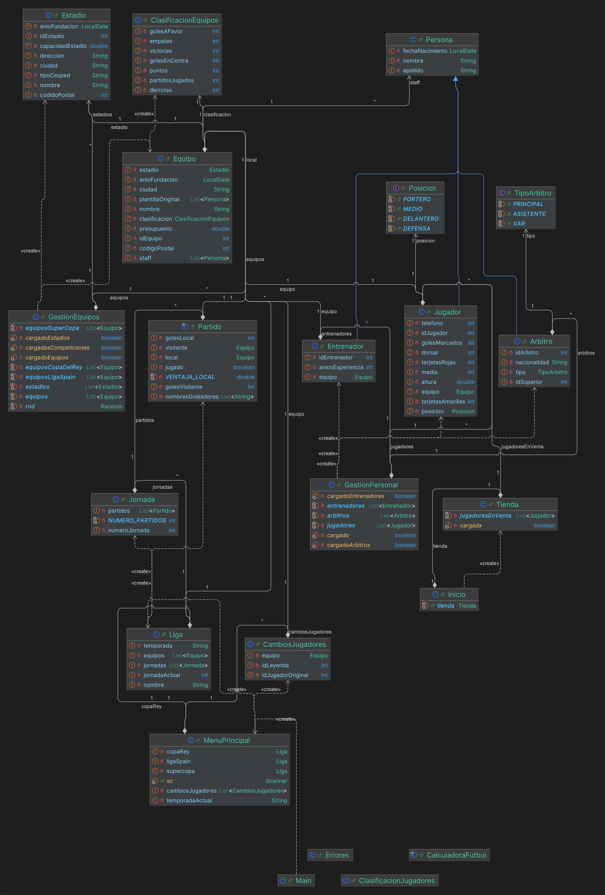

# XtartManager

Proyecto en **Java (JDK 21)** desarrollado con **IntelliJ IDEA**. Simula la gestión y la competición de una liga de fútbol: carga de datos desde ficheros, gestión de equipos y personal, simulación de jornadas/partidos y generación de clasificaciones.

## Requisitos

- **JDK 21**
- **IntelliJ IDEA** (recomendado)

## Cómo ejecutar

### Opción recomendada: IntelliJ
1. Abre el proyecto en IntelliJ.
2. Configura el **Project SDK** a **JDK 21**.
3. Ejecuta la clase:
    - `xtartManager.Main`

## Menús y navegación

Al ejecutar `xtartManager.Main` se cargan los datos y se muestra el **menú principal**:

### Menú principal
- **1. Ver Equipos y Jugadores**
- **2. Jugar una Liga**
- **3. Salir**

### Menú de ligas (opción 2)
Permite seleccionar la competición:
- **1. Copa del Rey**
- **2. Supercopa**
- **3. Liga Española**
- **4. Volver al menú principal**

### Menú de competición (ejemplo: Copa del Rey 26/27)
Una vez dentro de una competición, se puede:
- **1. Jugar la siguiente Jornada**
- **2. Jugar todo el calendario**
- **3. Ir a la Tienda**
- **4. Ver la Clasificación de Equipos**
- **5. Ver la Clasificación de Jugadores**
- **6. Volver al Menú de Ligas**

## Flujo típico de uso

1. Ejecutar `xtartManager.Main`.
2. Entrar en **Jugar una Liga**.
3. Elegir competición (Copa del Rey / Supercopa / Liga Española).
4. Jugar jornadas o todo el calendario.
5. Consultar clasificaciones de equipos y jugadores (y acceder a la tienda si se desea).

## Estructura del proyecto

Paquetes principales:

- **`xtartManager.modelo`**
    - **`persona`**: todas las personas de la liga. Incluye `Persona` (abstracta) y sus derivadas (`Jugador`, `Entrenador`, `Arbitro`), además de enums como `Posicion` y `TipoArbitro`.
    - **`equipos`**: entidades como `Equipo` y `Estadio`.
    - **`competicion`**: lógica de competición (`Liga`, `Jornada`, `Partido`).
- **`xtartManager.gestion`**
    - Gestión del sistema y **listas estáticas** con los datos cargados.
    - Funcionalidades como gestión de equipos/personal, cambios de jugadores y tienda.
- **`xtartManager.interfaz`**
    - Menús e interacción con el usuario (`Inicio`, `MenuPrincipal`) y control de errores (`Errores`).
- **`xtartManager.clasificaciones`**
    - Cálculo de clasificaciones (equipos/jugadores).

- **` UML `**

## Datos

Los datos iniciales se leen desde ficheros `.txt` dentro de la carpeta `datos/`:

- `arbitros.txt`
- `entrenadores.txt`
- `equipos.txt`
- `estadios.txt`
- `jugadores.txt`

> **Importante:** mantén el formato de los archivos `.txt` para que la carga de datos funcione correctamente.

## Funcionalidades

- Carga de datos desde ficheros y almacenamiento en listas.
- Gestión de equipos y personal de la liga.
- Simulación de competición: ligas, jornadas y partidos.
- Clasificaciones de equipos y jugadores.
- Menú interactivo para navegar por el sistema.

## Autores

- Noemí Cano Conesa
- Laura Otero Martín
- Sergio Rodríguez López